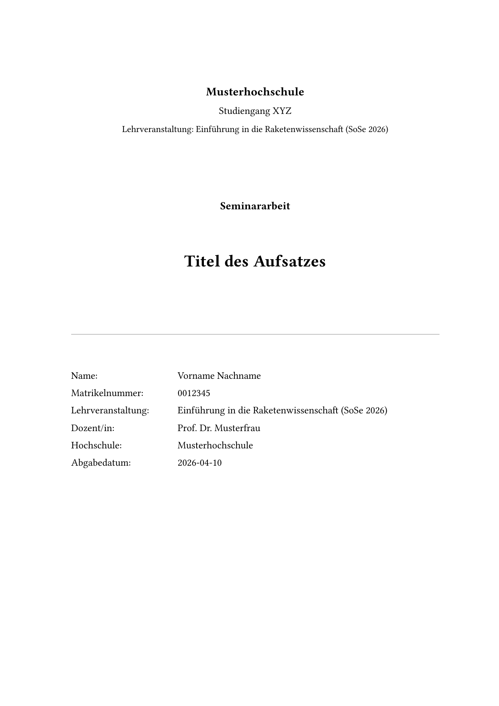

# aufsatz

`aufsatz` is a Quarto extension providing a template for academic reports (such as student term papers or essays) via rendering to PDF using Typst

# Requirements

[Quarto](quarto-typst-academic-template) is needed.
See the Quarto documentation for more details.


## Installation

To install this extension in your current directory (or into the Quarto project that you're currently working in), use the following command in the terminal:

``` bash
quarto install extension sebastiansauer/aufsatz
```

You can also install and use Quarto extensions via R.
See [the *Get Started* Quarto documentation](https://quarto.org/docs/get-started/hello/rstudio.html) for details.

## Quickstart

Just use a Quarto template that bundles a .qmd starter file. In the terminal, run:


``` bash
quarto use template sebastiansauer/aufsatz
```


Open the downloaded folder in RStudio or Positron or some other text editor.
Hit `Render` to see the rendered PDF. 

Here's an image of the rendered version of `template_no_r_packages_needed.qmd`.




You don't need any installed R packages for *this* example.

See [this video on YouTube](https://youtu.be/mRH63H2D0l0) for a demonstration (in German language).

## Template using some R packages

Open `template.qmd` to see an example using some R packages. 
You can find the list of needed R packages in `analyse.r`.
Open `template.pdf` to see the rendered PDF.


## Enter your text

Just replace the example value in `template.qmd` with your own text.

## Limitations

Some parts of the report template are currently hard-coded to German language terms, such as "Hochschule" (for "university").

Feel free to change `typst-template.typ` to match your needs.


### Update

Updating to the latest version:

In the terminal, run

```bash
quarto update sebastiansauer/aufsatz
```


## Removing the extension

In the terminal, run


```bash
quarto rmeove sebastiansauer/aufsatz
```


## Have fun!
