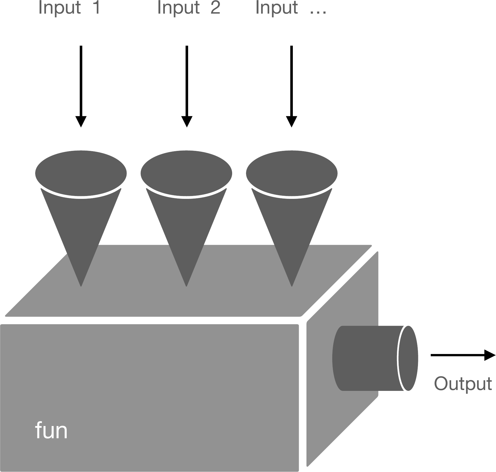

# Einleitung

Hier beginnt der Hauptteil des Aufsatzes. Die Einleitung führt in das Thema ein, benennt die Forschungsfrage und gibt einen Überblick über den Aufbau der Arbeit.

Wissenschaftliche Texte zeichnen sich durch klare Argumentation und sorgfältige Quellenangaben aus [@musterautor2023]. Jede Behauptung sollte durch Belege oder logische Schlussfolgerungen gestützt werden.



# Theoretischer Hintergrund

## Grundlegende Konzepte

In diesem Abschnitt werden die theoretischen Grundlagen des Themas erläutert. Es empfiehlt sich, einschlägige Fachliteratur zu zitieren und die verwendeten Begriffe klar zu definieren.

@fig-bild1 zeigt ein Bild.

{#fig-bild1 width=25%}

## Stand der Forschung

Der aktuelle Forschungsstand zeigt, dass die hier untersuchte Fragestellung von verschiedenen Perspektiven betrachtet werden kann [@weitererautorin2021].



# Methodik

Dieser Abschnitt beschreibt das methodische Vorgehen. Bei empirischen Arbeiten gehören hierher: Forschungsdesign, Stichprobe, Erhebungsmethoden und Auswertungsverfahren.

## Forschungsdesign

Das gewählte Forschungsdesign wird hier begründet und erläutert.

## Datenerhebung

Die Methoden der Datenerhebung werden detailliert beschrieben.



# Ergebnisse

In diesem Abschnitt werden die Ergebnisse der Untersuchung dargestellt. Tabellen und Abbildungen können den Text ergänzen und komplexe Sachverhalte veranschaulichen.

| Variable  | Mittelwert | Standardabweichung |
|-----------|------------|--------------------|
| Merkmal A | 3.42       | 0.87               |
| Merkmal B | 4.15       | 1.03               |

: Deskriptive Statistik der Untersuchungsvariablen {#tbl-deskriptiv}

Die Ergebnisse in @tbl-deskriptiv zeigen, dass ...

Man kann die Ergebnisse eines R-Befehls direkt einbinden, s. @fig-mtcars1.

```{r}
#| echo: false
#| message: false
#| label: fig-mtcars1
#| fig-cap: "Hier sieht man ein Diagramm, das mit R erstellt wurde."
library(tidyverse)
data(mtcars)
ggplot(mtcars) +
  aes(x = hp, y = mpg) +
  geom_point()

```






# Literaturverzeichnis {.unnumbered}

::: {#refs}
:::
